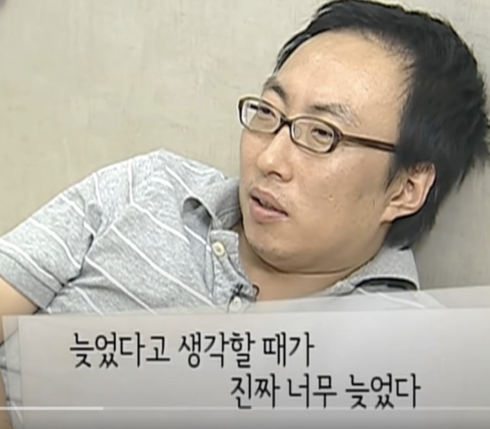
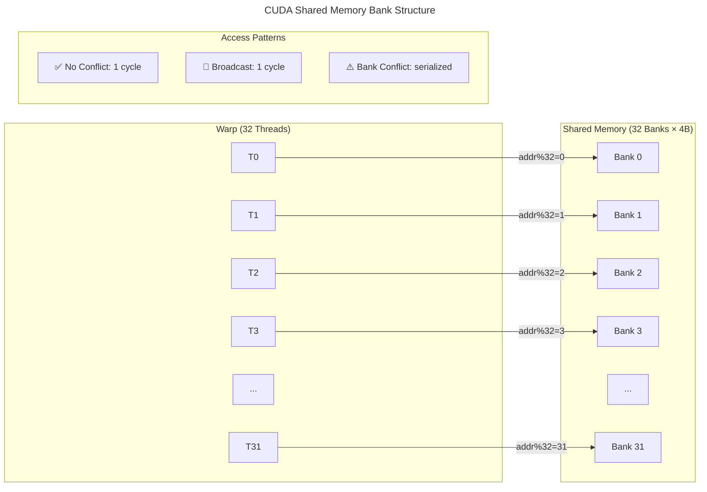
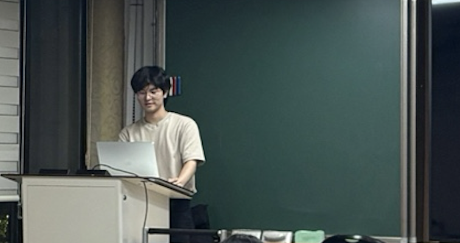
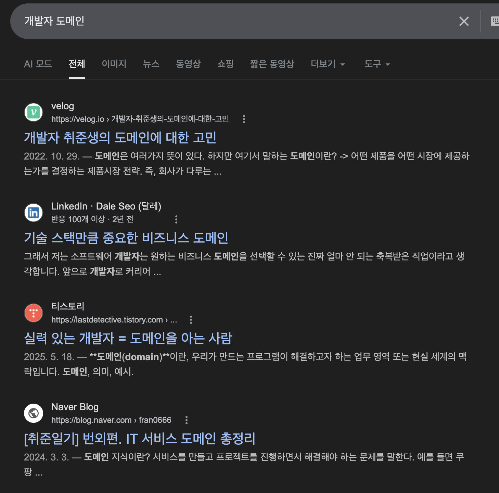
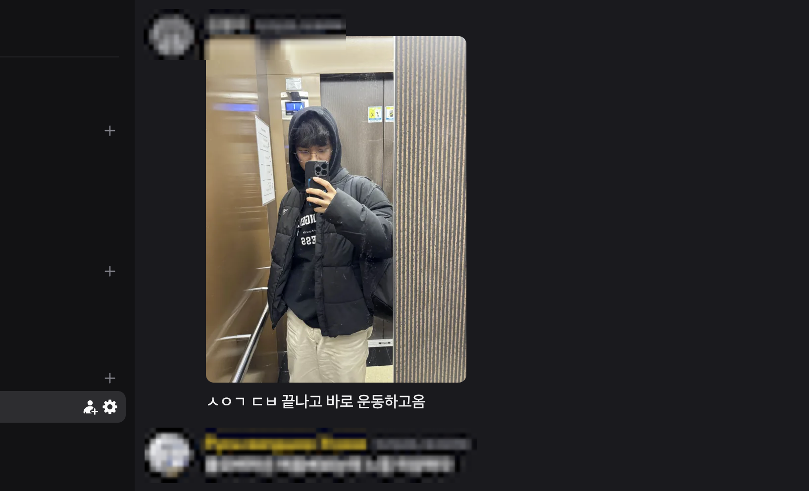

나도 안다. 3월이 다 되어서야 이제야 회고를 쓴다니... 새롭게 시작한다며 다짐하는 내가 부끄럽게 여겨진다. 그래도 시간이 지나도 회고를 이제서야 하는 의의가 여기에 있다. 회고를 할 때에는 ***앞으로 이렇게 계속 해야지, 다음에 이렇게 하지 말아야지*** 라는 결심을 하면서 같은 실수를 반복하지 않기 위함이다.

하지만!! 그럴 수 밖에 없었던 큰 이유가 있다. 정말 다사다난했던 그런 뒷사정들을 천천히 풀고자 한다.

## 2025년도 하반기 목표 체크

저번 체크리스트 자체가 아무래도 두루뭉술했어서, 이번엔 분류를 나누어서 상세하게 나누어보았다.

### 도메인 정하기
- [x] 기술적 도메인 정하기 - 나는 앞으로 백엔드 개발을 하는 것에 다른 여지가 없음을 확신했다. 그 중에서도 백엔드 내에서도 설계 쪽에 집중하기로 마음먹었었다. 이건 프로젝트를 하면서 깨달은 부분이니 상세하게 얘기해보겠다.
- [ ] 추가 - 비즈니스적 도메인에 대한 공부가 필요함을 느꼈다. 자세한건 후술.

### 기초 공부하기
- [x] 백엔드의 기초 중의 기초, 데이터베이스 를 수강했다.
- [x] SQLD 자격증 따기
- [x] 스프링 기초 공부 -> 동아리 부트캠프를 운영하며 기초적인 공부를 했다.
- [ ] CS 기초 공부 -> 면접에서 제대로 답변을 못하며 아직 제대로 안되었구나 깨달았다..
- [x] 대규모병렬컴퓨팅(MPC) 를 수강했다. 수강하면서 정말 컴퓨터의 근본을 깨달을 수 있었던 것 같다.

### 인프라에 대한 관심 가지기
- [x] 홈서버를 사용하며 리눅스를 계속해서 연구하기
- [x] 도커에 대한 관심가지기 - 도커 컴포즈를 공부하면서 애먹었었다... [블로그 글 보기](https://blog.blu3fishez.org/2025-10-30-docker-container-networking/)
- [ ] 클라우드에 대한 관심 가지기 - 아무래도 돈이 없다보니, 클라우드 자체를 써볼 기회가 적었다... 애초부터 돈이 부족하다 ㅠㅠㅠ

### 프로젝트 기반 러닝 수행
- [x] 데이터베이스 수업에서 팀 프로젝트를 수행했다. 클로드 코드를 처음 써보고 느낀점들을 상술해보겠다.
- [ ] 부스트캠프 프로젝트 리팩토링에 실패했다... ~~미안해요 팀원분들..~~

## 본격적인 회고

전반적으로 엄청 바빴었다. ~~매번 바쁘대..~~ 

### 학교 공부, 기초 공부에 몰두했고, 높은 성적을 얻었다

2025년도 하반기는 나에게 있어 4학년의 처음이기도 하지만, 막학기를 편하게 보내기 위해 억지로 21학점을 들었었다. 더군다나 이번에는, 전공 수업도 듣고싶은게 많았고, 특히, 우리학교 교수님의 데이터베이스 수업이 평가가 좋다고 들었어서 들었는데,, 많이 힘들었었던 것 같다. 다행히 `A0` 라도 받아서 다행이긴 했다. 되돌아보면 교수님께서 엄청나게 열정이 있으셨고, 팀 프로젝트까지 수행하는 그런 수업이었는데... 오히려 좋았던 것 같다. 

DB 수업의 경우 다사다난 하긴 했는데, 가장 어려웠던 점은 뭐냐면 수업 초반에 원하는 사람끼리 팀을 구성해서 3인 1조의 팀 프로젝트를 수행할 수 있다는 점이었다. 사실상 화석(ㄱ-)인 내가 팀 프로젝트를 하기 위해 사전에 마음이 맞는 사람을 바로 구하긴 쉽지 않았다. 

다른 사람들도 경험이 적은 쪽의 사람들은 더욱 팀원을 구하기 어렵다보니, 아무래도 나보다 상대적으로 경험이 적은 사람들과 팀 프로젝트를 할 수 밖에 없었고, 진도 측면에서 정말 뒤쳐질 수 밖에 없었다. 그러다보니 팀프로젝트의 경우 처음으로 `Claude Code` 를 써보면서 AI 활용을 해보는 방법을 기르게 된 계기가 되었다. 시간과 비용은 제한적인걸 어떻게 할까.. 라는 생각이 들었다.

하지만 아쉬운 점도 있었는데, 과연 이렇게 하는게 아무리 학교 프로젝트라지만 타인과의 협업에 건설적인 모습이라고 생각되진 않는다. 지금 생각해보면, **역량에 맞는 태스크 분배 및 MH(맨아워) 추산 능력이 정말 중요하다고 생각된다.** 보통 협업을 하고 태스크를 부여할 때, MH 단위로 산출을 해주지만, 보통 그 작업량의 단위를 나 자신으로만 생각했었다. 각자의 팀원의 MH 역량 단위를 측정해보는게 중요하다는 것을 깨달았고, 협업 초기에는 이런 시행착오가 반드시 생길 수 밖에 없음을 느끼게 되었다.

더 자세한 결과물은 팀 프로젝트 [Phase 3](https://github.com/DBProjectTeam15/Phase3) 와 [Phase 4](https://github.com/DBProjectTeam15/Phase4)는 여기서 볼 수 있다! 

두번째로, 대규모 병렬 컴퓨팅 수업을 들을 수 있었다. 우리 학교 학생이라면 응당 들어야할(우리학교에서만 유일무이하게 들을 수 있는) 수업이고, 2025년 상반기 시즌에 GDG 대구 DevFest 등에서 선배님들부터 여태 대기업에 합격하신 다른 선배님들까지 추천해주신 강의였다. 더군다나, 돈을내고 들을 수도 없으며 저작권 이슈도 있기 때문에 정말 귀한 기회라고 판단했다.

정말.. 좋은 강의였다고 생각한다! CUDA 를 처음 알게 되었는데, 병렬 컴퓨팅을 배우면서 스크래치패드 메모리, 하드웨어적 캐싱을 고려한 프로그래밍을 배울 수 있어서 좋았다. 가령 스크래치 패드 메모리의 뱅킹 개념이라던지 말이다. 아래 그림처럼, 하나의 Warp 내에서 직접적으로 Shared Memory 를 참조할 때, 32개의 단위로 나뉘어있기 때문에 병렬적으로 효율적으로 접근하는 방법에 대한 고민을 다룬다. 자세한건.. CUDA 를 공부해보면 좋을 것이다!

그렇게 열심히 공부한 끝에 `A+` 성적도 딸 수 있었어서 너무 좋았다! 앞으로도 이렇게 당장 어려워보여도 직접 해내는 시도는 해볼 것 같다. 두려움을 이겨냈을 때의 리턴의 그 짜릿함을 느껴봤달까...

### 본격적인 동아리 활동

그리고 학교생활도 조금 열심히해봤는데, ~~완전 아싸였던~~ 내가 조금 용기를 내서 지원했던 동아리 내에서 어떤 활동도 해보고, 노력도 해봤다. 사실 하나 아쉬운게 있다면, 동아리 내에서 개발팀이 있었는데, 여기서 적극적으로 개발해볼 기회가 정말 `아예` 없었다. 😭

이슈를 끊고 유지보수하는 것도 좋지만, 테스트코드 작성, 로컬 환경 구성 등 해보고 싶은건 많았는데, 기회가 적었어서 정말 아쉬웠다.

대신, 1학년 때부터 알고지냈던 친구를 도와 교육 운영진을 한번 해볼 기회가 있었고, 소프트스킬을 기를 수 있게 된 계기가 되었다. 배경과 지식 수준이 다른 학생들에게 어떻게하면 지식을 전달해줄 수 있을지 고민을 많이 했고, 나름의 결론에 도달했다. **결국 시간과 비용은 어쩔 수 없다는 것이 내 결론이었다. 즉, 나는 확실하지만 기초적인걸 배우게하자는 주의였다.** 반면, 해커톤에 대비할 수 있게하자는 것이 동료의 주장이었다. 결국, 해커톤을 위한 부트캠프였어서 어쩔 수 없이 빠듯하게 끝났지만, 솔직한 감정으로는 학술동아리의 부트캠프가 해커톤이라는 거 하나를 위해 이렇게 진행되는 것이, 의미가 과연 있는걸까 싶은 생각이었고, 그로 인해 아쉬운 마음이 큰 건 어쩔 수 없나보다.

마지막으로, 소프티어 부트캠프 7기 백엔드 분야에 지원했는데, 첫 기술면접을 해보면서 실전에서 내가 많이 약하다는 것을 깨달았다. **기술면접이 보통 쉬운일이 아님을 깨달았고, 단순히 지식을 아는 것이 내가 정말로 아는 것인지를 여러번 체크를 해야함을 인지하게 되었다.**

### 비즈니스 도메인을 탐색해보기

이전 회고에서, 내가 하나를 확실히 정해서 T자형으로 기술적으로 하나를 알더라도 깊게 공부하기로 결심했었다.

**그런데, 도메인을 정한다는 게 무엇일까?** 고민을 많이했다. 개발자에게 있어, 도메인이란 무엇인지 궁금해서 그냥 단순히 구글 검색을 했었다.

도메인이란 용어를 단순히 사용했었지만, 우리가 흔히 쓰면서 잘못 쓰는 용어가 될 수도 있겠다고 생각했다. 도메인이라는 것이 기술적 도메인도 될 수 있지만, **비즈니스 영역**에 해당되는 말도 있다는 것을 알았다.

결국에는 기술적 도메인을 정하자는 전제가 틀렸음을 알게 되었다. 동시에, 나는 비즈니스 도메인으로 이전 네이버 부스트캠프에서 진행한 화상통화, 미디어 서버 쪽은 아님을 확신했다. 아무래도, 위 체크리스트에서 언급했던 것처럼 계속해서 리팩토링에 실패했기 때문에. 내가 진심으로 원하는 도메인이 아님을 확실히 인지하게 되었다.

### 소프티어 부트캠프 7기에 합격하다

그리고, 소프티어 부트캠프 7기에 합격했다. 소프티어 부트캠프의 자세한 과정에 대해서는 다음 회고 글에서 얘기할 예정이다.

### 헬스를 다시 시작하다

다시, 헬스를 시작했다. 우리 학교 정문쪽에 다른 헬스장이 있었는데, 시설도 꽤 괜찮았고, 무료로 커피(!!)를 주는 곳이 있었다.

덕분에 매일매일 대학 동기 톡방에 오운완 사진도 올리면서 공유했었다. ㅋㅋ

헬스를 하면서 깨달았는데, 확실히 **운동을 해야 스트레스 관리가 됨을 깨달았다. 특히 유산소를 하면서 정신관리가 잘 됐던 것 같다.** 그런 릴스를 본 사람이 있는지 모르겠다. 달리다가 쉬는 사람한테 헤어진 여자친구 얘기를 하니 갑자기 뛰는 그런(?) 릴스가 있었는데, 정말로 일단 막상 달려보니 확실히 생각이 정리되고 감정 조절도 잘 되었던 것 같았다.

### 첫 기술면접을 해보다

그리고 나는 이번에 슬슬 본격적으로 취업을 해보면서, 정말로 취업이 쉽지 않음을 느꼈다.

첫번째로, 네이버페이 지원이었다. 이번 네이버페이에 지원하면서 **서탈**이라는 광탈을 겪어보지 않은 내가 처음으로 광탈을 맛보고 생각보다 쉽지 않구나를 느꼈고, 취준길이 험하구나 실감하게 되었다.

그리고 이번 소프티어 7기 에서는 선발 과정에서도 자만심을 가지고 있음을 느꼈다. 이번 소프티어 선발 과정에서는, 저번과는 다르게 처음으로 기술면접을 먼저하고 부트캠프에 참여할 수 있는 구조였다.

당시 상황의 나는 "기술면접이야 얼마나 어렵겠어? 나는 기초공부도 열심히했고, 개발에 대해 누구보다 관심있는걸" 이라고 생각하며 큰 문제 없이 생각했었는데, 많이 절었고, 실제로 부트캠프에 떨어지기도 했었다. 하지만 다행히도 후에 추가 합격 등록 연락이 왔었고, 그렇게 추하게 합격하게 되었다.

면접의 기본기인 `자기소개`, 그리고 공격형 면접 / 방어형 면접 등 기본적으로 어느정도 취업준비에 신경쓰지 못한게 살짝 후회가 되었다. **어떤 일이든 잘 알고 있다고 자만하지말자고** 예전부터 이런 마음가짐을 가지려 노력은 많이 했지만 생각보다 쉽지가 않았던 것 같다. 메타인지의 필요성을 느꼈다.

## 결심

### 앞으로의 회고 방향

앞으로 회고글을 작성할 때, 그냥 내 마음대로 기술한다면 어찌보면 그냥 "일기"가 될 수도 있다는 생각도 들었고, 막상 회고하고싶은데, 회고할 거리가 생각이 안날 수도 있으면 회고 주제에 대한 압박도 있겠다는 생각이 들었다.

그래서 앞으로 회고 방향을 잘한 점과 못한 점을 적고, 개선할 방향을 체크리스트로 계속 써보려고 한다. 이미 잘 지키고 있지만, `이전 목표 체크` + `본격적인 회고` + `결심` + `다음 목표` 구조 로 좀 더 명확히 하고자 한다.

### 체화를 생각하기 + 메타인지 능력 키우기

위에서 얘기한 기술면접의 패착이 무엇일까 고민을 많이 했다. 상반기 회고에서도 대학 동기가 당연하게 여길 수 있을만큼의 확고함과 단단한 지식의 근간이 무엇일까 생각했다.

공부를 할 때, **이 지식 자체를 내껄로 만들었을까?** 라는 생각을 하게 되었다.

## 2026년도 1분기 목표

- [ ] 체화의 의미 생각해보며, 지식과 기술을 체화시킬 방법을 찾아보기
- [ ] 소프티어 하며 사회생활 제대로 배워보기, 동아리 생활하며 아쉬웠던 점을 돌아보며..
- [ ] 메타인지 잘하는 방법 탐구해보기

여튼 올해 1분기에도 많은 일들이 있었기 때문에 여기까지! 끊고, 나중에 다시 적어보도록 하겠다!